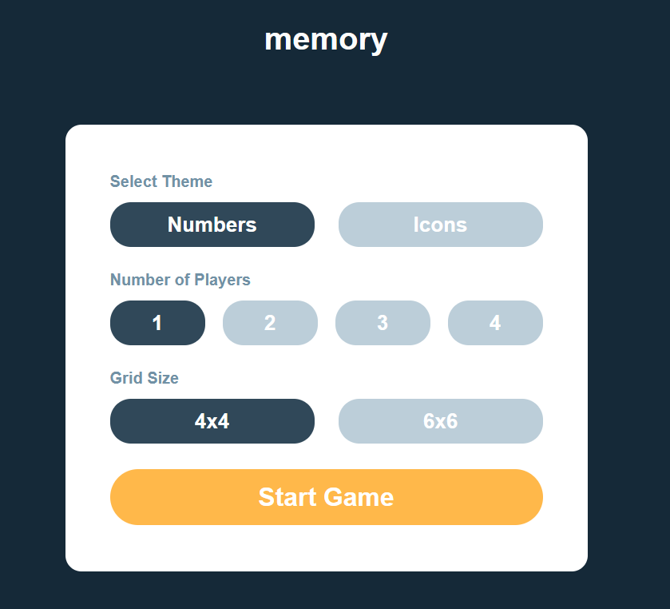

# Memory Game

## Tech Stack

- Semantic HTML5 markup
- CSS
- TypeScript
- React
- Tailwind CSS

## Live Demo

Explore the live demo of the Memory Game [here](https://ralfislask.github.io/Memory-Game/).

## Status

This project is marked as "In Progress."

## Getting Started

To run the Memory Game on your local machine, follow these steps:

1. Download or clone the repository.
2. Install the necessary dependencies by running `npm install`.
3. Start the application using `npm start` (Create React App).

## App Description

The Memory Game is an engaging web application that challenges your memory skills. It offers various options to customize your gameplay experience:

1. **Theme**: Choose between Numbers or Icons to match.

2. **Number of Players**: Play solo or invite friends for a multiplayer experience (up to 4 players).

3. **Grid Size**: Select the grid size - 4x4 or 6x6.

### Gameplay Features

- For solo players, the game includes a timer and a moves counter to track your progress and performance.
- Multiplayer mode displays each player's scores, and the player with the highest score wins after completing the game.
- Enjoy the convenience of restart and new game buttons to enhance your gaming experience.

## Author

- Frontend Mentor - [@RalfiSlask](https://www.frontendmentor.io/profile/RalfiSlask)
- GitHub - [RalfiSlask](https://github.com/RalfiSlask)
